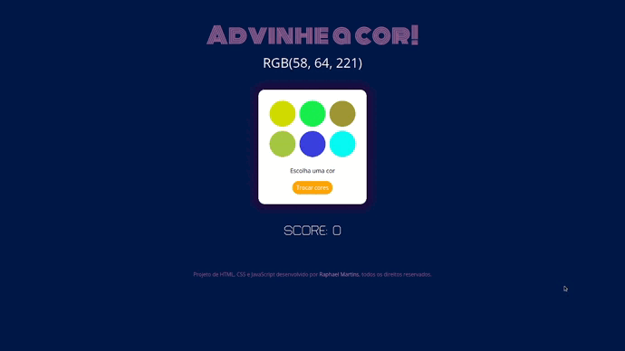
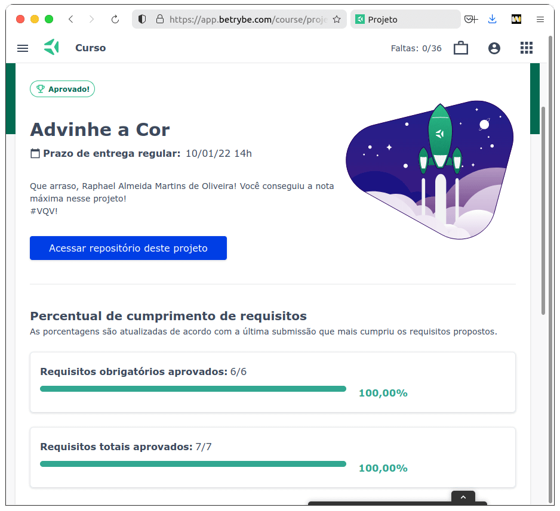

# :art: Color Guess Game :art:

## :page_with_curl: About

Project of HTML, CSS, and JavaScript developed by me ([Raphael Martins](https://www.linkedin.com/in/raphaelameidamartins/)) at the end of the Unit 5 Module 1 of the Web Development course at [Trybe](https://www.betrybe.com). I was approved with 100% of the mandatory and optional requirements met.

We had to develop a color guess game. The user needs to guess which color from a randomly generated palette corresponds to the RGB value displayed on the screen. If they get it right, they earn 3 points. The points accumulate in every hit.

[Click here](https://raphaelalmeidamartins.github.io/color-guess/) to check out the final version of the project on your browser.

## :hammer_and_wrench: Tools

* HTML5
* CSS3
* JavaScript ES6+

## :trophy: Grade

### :copyright: Copyright disclaimer

I developed this project for learning purposes, all the code and documentation texts in Portuguese and English are my authorship, and the rights belong exclusively to me. It is allowed to download or clone the repository for study purposes. However, it is not allowed to publish full or partial copies. This disclaimer does not cover libraries and dependencies, which are subject to their respective licenses.
